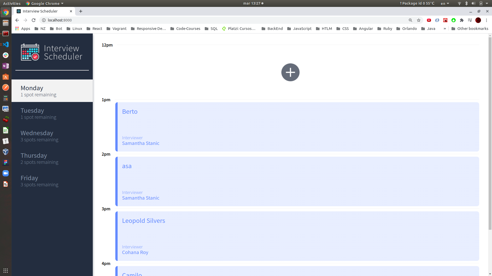
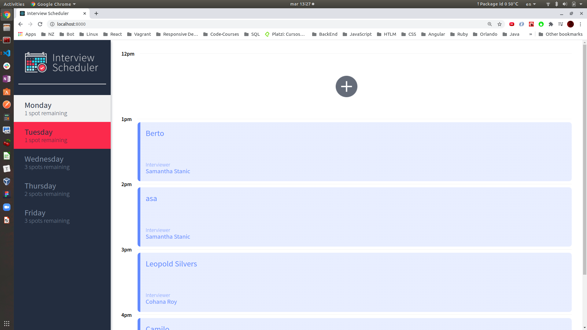
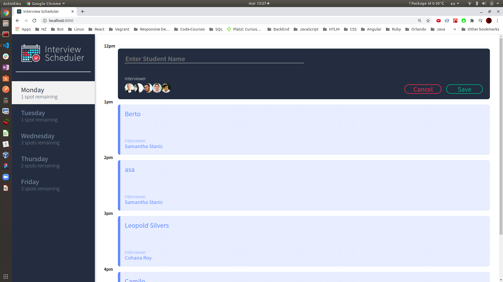
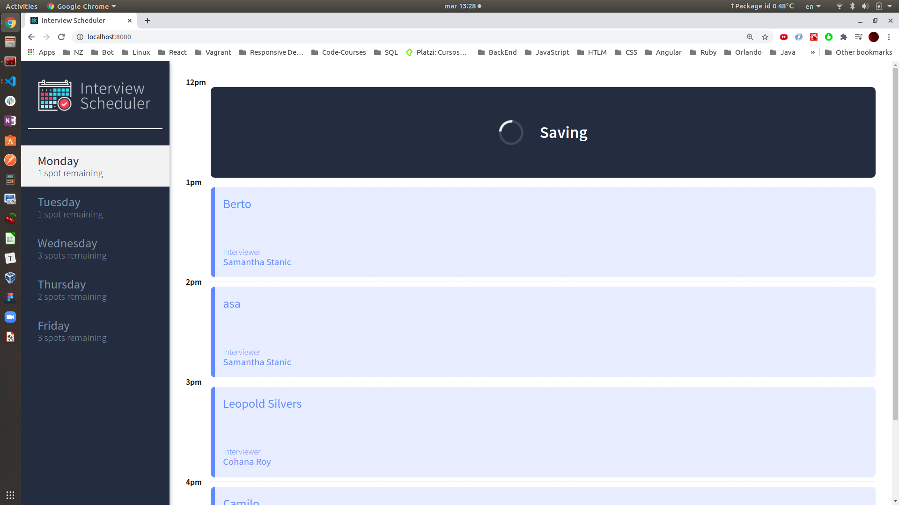
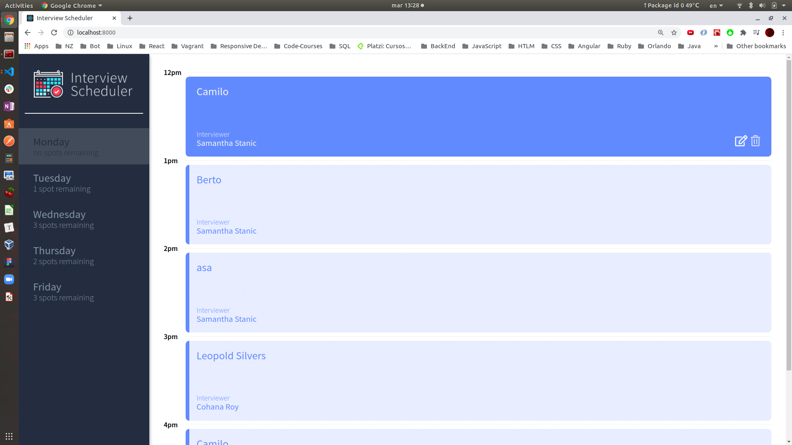
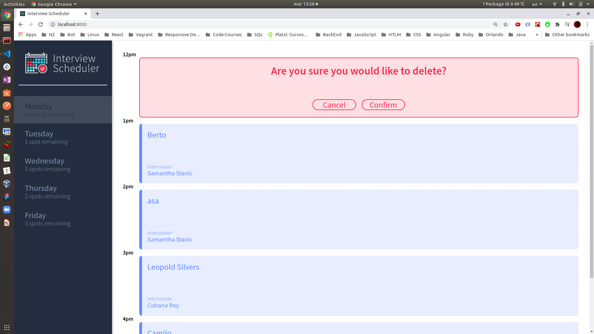
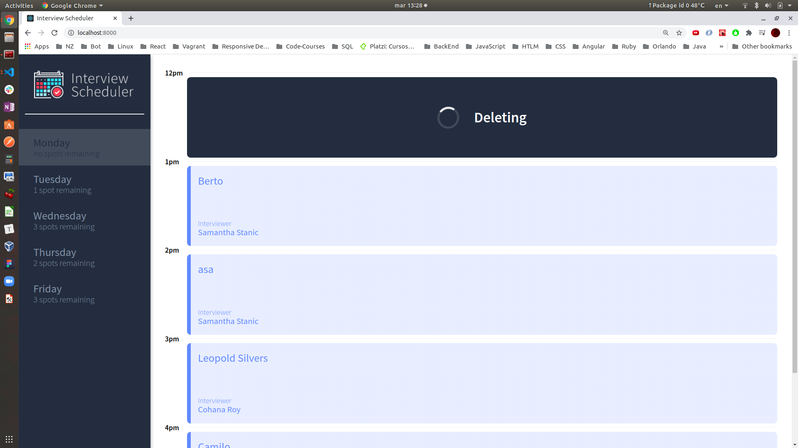

# Interview Scheduler

Interview Scheduler is a single-page aplication builded in React.

This repository we build and test a React application that allows users to book and cancel interviews. We combine a concise API with a WebSocket server to build a realtime experience. We build this project to practice React, HTML, CSS, JS,JSX, front-end skills, and Node, Express and PostgreSql back-end skills and we added some test in jest and cypress.

## Setup

Install dependencies with `npm install`.

## Running Webpack Development Server

```sh
npm start
```

## Running Jest Test Framework

```sh
npm test
```

## Running Storybook Visual Testbed

```sh
npm run storybook
```

## Final Product

### Load Page (width 1024px)



### Hover other day in day list (width 1024px)



### Add a new appointment (width 1024px)



### Warning if save with no name in a new appointment (width 1024px)


### Saving status after save a new appointment (width 1024px)



### New appointment added (width 1024px)



### Confirm Delete appointment(width 1024px)



### Deleting status after confirm delete an appointment (width 1024px)


